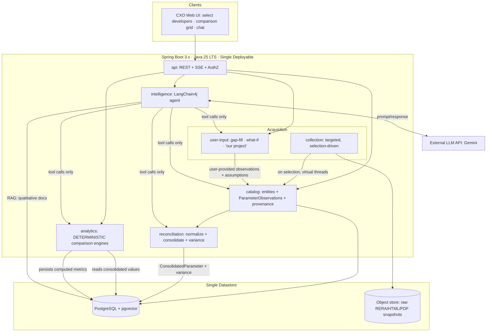
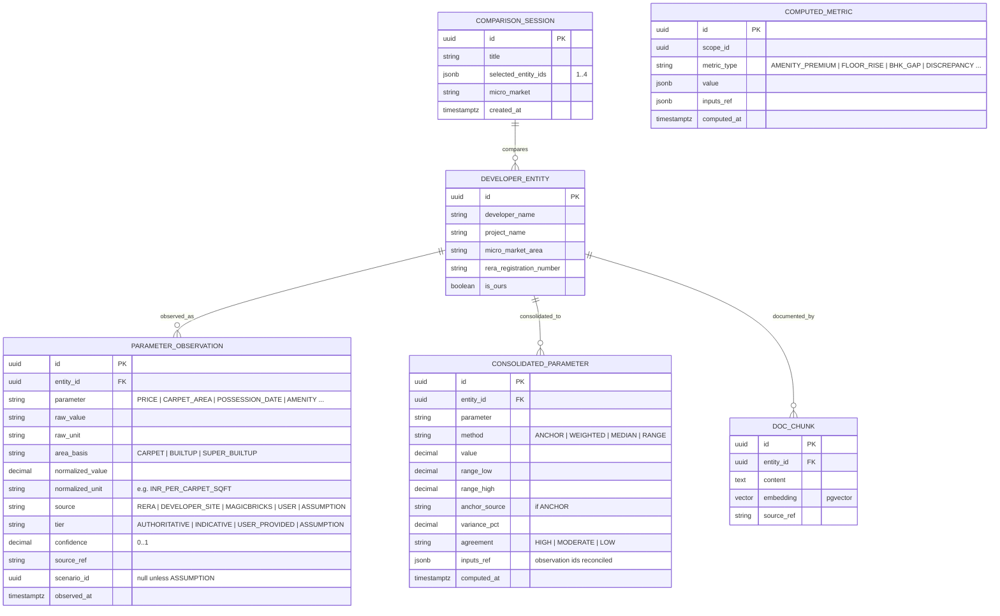

# Architecture & Design (v2.2)
## Real Estate CxO Decision-Support Agent

> **Design intent:** An AI agent that helps a real-estate CXO compare a **small, user-chosen set of
> developers (1–4)** and make strategic decisions. The engine collects the **credible structured data
> that exists** (RERA-first), gathers a **comparable set** for benchmarking, is **honest about what's
> missing**, lets the user **fill gaps and run what-ifs**, and **reconciles conflicting values across
> sources with full citation** — never silently averaging away the disagreement.

> **Locked decisions & scope (2026-06-01):**
> 1. **Runtime = Java 25 (current LTS).** GA features only; no preview APIs in production.
> 2. **Bounded selection:** user picks **1–4 developers**; collection is **targeted**, not a web-wide crawl.
> 3. **Credible public data is thin.** RERA is the authoritative structured source; listing portals are
>    *indicative* (advertised, often inaccurate). Most credible comparison data is not reliably online.
> 4. **"Private data" = user-supplied input** to (a) fill gaps where credible data is missing and (b) drive
>    what-if scenarios. It is not a CRM/warehouse integration.
> 5. **Conflicting values are reconciled, not averaged.** Keep every source value, normalize, anchor on
>    credibility, show the spread, cite all sources.

---

## 0. Two Non-Negotiable Rules

**Rule 1 — The LLM orchestrates and narrates; it never calculates *or averages*.**
Every number a CxO sees is produced by deterministic, unit-tested code and passed to the LLM as a tool
result, with a citation and credibility tier. The LLM picks which tool to call and phrases the answer.

**Rule 2 — Never collapse a value silently.**
When the same parameter has different values across sources, the system keeps all observations, reconciles
them transparently (normalize → anchor → show spread), and always exposes the underlying values. Honesty
about provenance and disagreement *is* the trustworthiness of the product, because credible data is sparse.

---

## 1. Requirements

### Functional
- Let the user **select 1–4 developers/projects** to compare (optionally flagging one as "ours").
- **Targeted collection** of credible data for the selected entities — **RERA-first** (authoritative),
  developer sites and listing portals as lower-credibility supplements.
- **Comparable-set gathering**: pull a like-for-like sample (same micro-market + BHK config) to benchmark.
- **Multi-source reconciliation**: where a parameter (price, area, possession date…) differs across
  sources, normalize, consolidate by credibility, compute the variance, and **cite all source values**.
- **Gap detection + fill**: flag attributes with no credible value; let the user supply them.
- **What-if analysis**: user overrides/assumes values; deterministic engine recomputes; results labeled
  as scenarios, not facts.
- Deterministic analytics: amenity premium, floor-rise curve, BHK-supply gap, RERA-vs-listing discrepancy.
- A conversational agent that answers comparison questions, **always stating each figure's credibility tier**.
- Role-oriented views (CEO / MD / CSO).

### Non-functional
| Concern | Target | Note |
|---|---|---|
| Scale | 1–4 developers per comparison; small comp sets | Tiny — do not over-build |
| Query latency | < 3 s on stored/consolidated data | Queries never trigger live collection |
| Agent latency | Streamed; first token < 5 s | SSE; LLM-bound |
| Availability | Single-region, business-hours; read-only when collection is down | |
| Auditability | Every figure traces to its source observation(s) + tier | Hard requirement |

---

## 2. Corrections to the Original Plan (the "prudent" deltas)
| Original (v1) | Assessment | Prudent choice (v2.2) |
|---|---|---|
| **Java 25** | ✅ Kept — current LTS | **Java 25 LTS**, GA features only |
| **H2 in production** | No real persistence/concurrency | **PostgreSQL** (H2 for tests only) |
| **In-memory vector store** | Lost on restart | **pgvector** in same Postgres |
| **LLM runs the math** | Hallucination risk | **Deterministic Java computes; LLM narrates** |
| **Broad multi-portal scraping** | Out of scope + low credibility | **Targeted RERA-first collection on 1–4 selected developers** |
| **Listings as truth** | Advertised, often inaccurate | **Listings = indicative tier; RERA = authoritative** |
| **Heavy private-data module** | Over-built | **Lightweight user-input: gap-fill + what-if** |
| **Single value per parameter** | Hides source conflict | **Keep all observations; reconcile + cite (never flat-average)** |
| **Sales velocity as hard metric** | Depends on credible listing data we lack | **Demoted to *indicative*; flagged as such** |
| **No provenance/credibility model** | Can't audit | **Credibility tier + provenance on every observation** |

---

## 3. High-Level Architecture — Modular Monolith (Spring Modulith)



### Module rules (enforced by Spring Modulith)
- `api` → `intelligence`, `analytics`, `catalog`, `user-input`.
- `intelligence` → reads `analytics`, `catalog`, `reconciliation`, `user-input`. Never calls `collection`.
- `reconciliation` → reads `catalog` observations; writes consolidated values. Pure + tested.
- `analytics` → reads consolidated values + catalog. No dependency on collection/intelligence. Pure + tested.
- `collection`, `user-input` → write observations to `catalog` via its published API only.
- `catalog` → depends on nothing but `shared`. The shared contract.
- Side effects via **Spring application events**, so collection can fail/retry without blocking serving.

**Payoff:** a fragile source (or a blocked portal) breaks only `collection`. Reconciliation, analytics,
and the agent keep serving the last good observations.

---

## 4. Acquisition — Targeted, Not a Crawl

### 4.1 Collection (selection-driven)
Triggered when the user runs a comparison on the selected 1–4 developers. Two narrow jobs:
1. **Entity collection** — for each selected developer/project, fetch what's credibly available:
   **RERA lookup by developer/project name** (authoritative), then optional developer-site / listing
   supplements (indicative).
2. **Comparable-set gathering** — pull a like-for-like sample (same micro-market + BHK config) to compute
   benchmarks (median PSF, amenity premium, floor-rise).

Controls (sized for low, targeted volume):
- **`DataSource` strategy interface** per source; each independently enable/disable-able and swappable for
  an **official/licensed feed** (strongly preferred for RERA at this volume — see §13).
- Polite rate-limiting + **Resilience4j** circuit breaker; **raw snapshot retention** (RERA/HTML/PDF →
  object store) for re-parse and audit; **parser-drift alerting** (field-coverage drop = source changed).
- Every fetched value is written as a **`ParameterObservation`** (not a flat field) tagged with source,
  **credibility tier**, confidence, ref, and timestamp.
- **Legal note:** any scraping of listing portals/RERA carries ToS/data-protection exposure; review before
  production. Architecture assumes sources will be restricted and built to swap them.

> Collection is **on-demand per comparison, with caching** of recent results. (Velocity-over-time would
> require scheduled re-snapshots — kept out of the core for now; see §11.)

### 4.2 User-input (gap-fill, what-if, "our project")
- **Gap-fill:** where collection found no credible value for a comparison attribute, the cell is flagged
  and the user can supply it → stored as an observation, tier `USER_PROVIDED`.
- **What-if:** user overrides/assumes values → stored as tier `ASSUMPTION`, scoped to a scenario, never
  mixed into factual consolidation.
- **"Our project":** optionally one selected entity is flagged ours; its values are mostly `USER_PROVIDED`.
- No CRM/ERP connectors, no column-mapping importer — just simple, validated form input.

---

## 5. Data Model (observation-based, credibility-aware)



Key points:
- **`PARAMETER_OBSERVATION` is append-only** — one row per (parameter, source). The three different prices
  are three rows, never overwritten. This is the citation backbone.
- **`CONSOLIDATED_PARAMETER`** holds the reconciled value + method + variance + `inputs_ref` back to the
  observations. The agent reads this and can always cite the originals.
- **`COMPARISON_SESSION`** scopes the bounded selection + comp set for reproducibility and caching.
- `tier` drives both reconciliation weighting and how the agent labels every figure.

---

## 6. Reconciliation Engine (multi-source value conflict)

The crux: the same parameter differs across developer site / RERA / MagicBricks. Deterministic 3-step process.

**Step 1 — Normalize (resolve fake disagreement first).** Convert to one canonical basis before comparing:
- **Area basis:** RERA = carpet area (legal); portals often super built-up (inflated 25–35%). Normalize
  price to **₹ per carpet sq ft** using RERA carpet area as denominator.
- **Price definition:** asking (portal) vs quoted (developer) vs registered agreement value (RERA) — tag,
  don't blend definitions blindly.
Much of the apparent conflict dissolves here.

**Step 2 — Consolidate by credibility (never flat-average):**
| Method | Behavior | Default use |
|---|---|---|
| **ANCHOR** *(default)* | Canonical = most credible source for that parameter (RERA for legal facts/area; developer site for official price); others shown as variances | Almost always |
| **WEIGHTED** | Single number weighted by tier (RERA ≫ developer site > portal) | When one representative figure is required |
| **RANGE / MEDIAN** | Present min–max or median + spread | To communicate uncertainty honestly |

**Step 3 — Quantify + expose the disagreement.** Compute `variance_pct` and an `agreement` band; a wide
spread is surfaced as a signal (negotiation room / possible RERA-vs-listing discrepancy), not smoothed away.

**Worked example (3BHK):**
| Source | Tier | Quoted | Area (as stated) | → ₹/carpet sqft* |
|---|---|---|---|---|
| MagicBricks | Indicative | ₹3.50 Cr | 1,200 super built-up | ₹38,900 |
| Developer site | Official | ₹3.40 Cr | 1,150 built-up | ₹37,800 |
| RERA | **Authoritative** | ₹3.20 Cr (agreement) | **900 carpet** | ₹35,600 |

\*normalized to RERA carpet = 900 sqft. Naive mean of totals (₹3.37 Cr) is meaningless. Anchored result:
**₹35,600/carpet sqft (per MahaRERA)**, advertised asking **+9% over registered** = the real, citable insight.

All reconciliation is deterministic Java with `inputs_ref`; the LLM never averages.

---

## 7. Gap-Fill & What-If Workflow
- **Gap-fill:** the comparison grid (entities × parameters) marks every cell as *credible* / *indicative* /
  *missing*. Missing cells prompt user input → `USER_PROVIDED` observation → re-consolidate.
- **What-if:** user opens a scenario, overrides values → `ASSUMPTION` observations scoped to `scenario_id`.
  The engine recomputes consolidated values and downstream metrics **within the scenario only**; factual
  consolidation is untouched. Results are labeled "scenario / assumption," never presented as fact.

---

## 8. Agent Design (intelligence module)
Tools (fixed, audited, wrapping tested services):
- `getComparisonGrid(sessionId)` — entities × parameters with consolidated values, tiers, gaps.
- `getParameterDetail(entityId, parameter)` — the consolidated value **plus all source observations** (the three values) for citation.
- `listGaps(sessionId)` — attributes lacking a credible value (to prompt the user).
- `getAmenityPremium / getFloorRise / getBhkGap / getDiscrepancies(...)` — deterministic analytics.
- `runWhatIf(sessionId, overrides)` — deterministic scenario recompute.
- `searchDocuments(...)` — pgvector RAG, qualitative context only.

Rules: every quantitative claim carries its **tier label** ("per MahaRERA, authoritative" / "advertised,
indicative" / "you provided" / "under your assumption") and, on conflict, the **spread + all source values**.
No data → "no data," never an estimate. RAG never supplies numbers.

---

## 9. API Surface (representative)
```
POST /api/comparisons                 -> create session with 1–4 selected developers
POST /api/comparisons/{id}/collect    -> run targeted collection (RERA-first) + comp gathering
GET  /api/comparisons/{id}/grid       -> consolidated comparison grid (values + tiers + gaps)
GET  /api/comparisons/{id}/parameter?entity=..&name=PRICE  -> consolidated + all source observations
POST /api/comparisons/{id}/gaps       -> user fills a missing value (USER_PROVIDED)
POST /api/comparisons/{id}/whatif     -> scenario overrides (ASSUMPTION) + recompute
POST /api/chat                        -> SSE; the CXO agent over the above tools
```

---

## 10. Technology Choices
| Layer | Choice | Why |
|---|---|---|
| Runtime | **Java 25 LTS** | Current LTS; team's choice |
| Concurrency (GA) | Virtual Threads (collection fan-out), Scoped Values (carry fetch context), Stream Gatherers (normalize/dedupe), record/pattern-matching switch (map raw → canonical) | All GA in 25; fit the ingest+normalize work |
| Concurrency (avoid) | Structured Concurrency | Still preview — adopt `StructuredTaskScope` when final |
| Framework | Spring Boot 3.x + **Spring Modulith** | Enforced boundaries, no microservice cost |
| Persistence | **PostgreSQL + Flyway** | Durable; versioned schema |
| Vector/RAG | **pgvector** | One datastore; persistent; auditable |
| Resilience | **Resilience4j** | Circuit breakers / rate limits on sources |
| Collection/parse | Jsoup + Apache PDFBox behind `DataSource` SPI | Isolated, swappable for licensed feeds |
| LLM | Gemini/Claude/ChatGPT via **LangChain4j** | Tool-calling + embeddings; provider-swappable |
| Object storage | S3-compatible (filesystem locally) | Raw snapshot retention |
| Tests | JUnit 5, Testcontainers, Modulith verification | Real DB; boundary enforcement |

Not adopted yet: Kafka/RabbitMQ, microservices, Redis, Kubernetes, MCP, Google ADK (LangChain4j native
tools suffice — revisit MCP only to *consume* a licensed data source, ADK only for multi-agent needs).

---

## 11. Scale, Reliability & What I'd Revisit
- Tiny volume (1–4 developers/session) → single deployable + managed Postgres is ample.
- **Source reliability is the #1 risk** (no broad fallback): per-source success rate + field-coverage are
  primary health signals; parser-drift alerting; last-good observations served when collection is down.
- **Monitoring:** Micrometer/Actuator; track collection success, % cells filled credibly, reconciliation
  variance distribution, LLM cost/latency, and "% answers served with full citations."
- **Revisit when:** velocity-over-time is wanted → add scheduled re-snapshots + history table; comp sets
  grow large → batch metric computation; a licensed RERA feed appears → swap the `DataSource`.

---

## 12. Prudent Delivery Order
1. **Walking skeleton:** Java 25 + Spring Boot + Postgres + Flyway + one Modulith boundary test; deploys + health.
2. **Catalog + observation model + Comparison Session** — create a session, hand-enter observations, build the grid. No external risk; proves the core model.
3. **Reconciliation engine** — normalization + ANCHOR consolidation + variance, with tests (the worked example as a fixture). First credible comparison grid with citations.
4. **Gap-fill + what-if** over user-input — completes the human-in-the-loop story with thin private data.
5. **RERA collection (authoritative)** through the `DataSource` SPI — favor an official/licensed feed; snapshot + resilience from day one.
6. **Agent over the existing tools**, then RAG, then optional indicative sources (listings), role UIs, discrepancy/amenity/floor-rise analytics.

Rationale: builds the *trust machinery* (observations → reconciliation → citation → gap-fill) before
betting on any external source, so the product is credible even with sparse data.

---

## 13. Open Questions for Stakeholders
- **Licensed RERA / structured data feed?** At this bounded volume it's affordable and far more credible
  than scraping — the single biggest risk reducer.
- **Velocity-over-time:** in or out of scope? It's the one feature that forces ongoing scheduled collection.
- Single-tenant (one developer's command center) or multi-tenant SaaS?
- Which parameters must be reconciled (price, area, possession, amenities, charges) and what's the
  authoritative source for each? (Drives the ANCHOR rules.)
- Data-residency / PII rules on sending any collected or user-provided data to Gemini.
```
