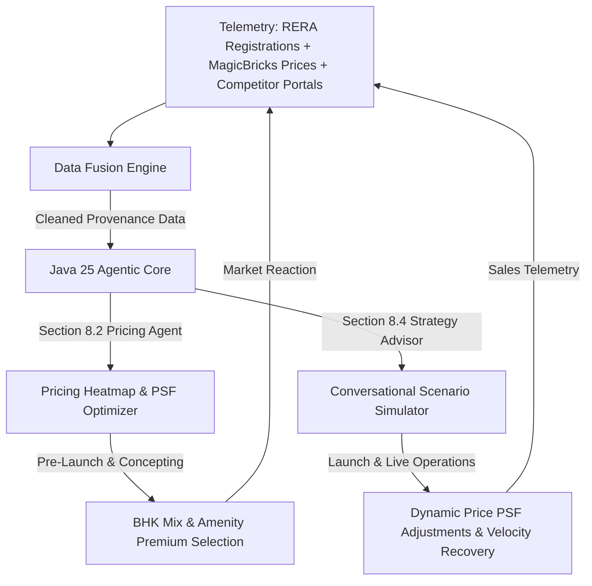

# CXO Strategic Value Analysis
## Real Estate AI-Powered Market Intelligence Platform

Real estate executive leadership teams (CEOs, MDs, Chief Strategy Officers, Chief Sales Officers) make massive capital allocation, product definition, and pricing decisions. Historically, these decisions are spreadsheet-driven, delayed by weeks, and rely on fragmented broker hearsay or incomplete listings.

The **Antigravity Real Estate Market Intelligence Platform** transitions executives from *reactive, gut-based decisions* to *predictive, data-fused strategic maneuvers*.

---

## 1. The CXO Strategic Decision Loop

---

## 2. CXO Strategic Decision Matrix

| Executive Role | Strategic Phase | Critical CXO Questions | System Telemetry & Insights | Strategic Value Unlocked |
| :--- | :--- | :--- | :--- | :--- |
| **Managing Director (MD) / Chief Strategy Officer (CSO)** | **Pre-Launch & Concepting** | <ul><li>What BHK configuration mix (2BHK vs 3BHK) is under-supplied in Thane?</li><li>What specific amenities are missing in a 2-mile radius of our acquired plot?</li><li>How long is RERA approval taking for competing builders in this micro-market?</li></ul> | <ul><li>**RERA Registration Auditing**: Maps exact upcoming inventory layouts, sizes, and registered developer pipelines.</li><li>**Amenity Density Vectors**: Identifies which amenities command the highest premium and which are saturated.</li></ul> | **Optimal Land Monetization**: Maximizes revenue per square foot (PSF) by defining the absolute highest-demand layout and facility mix prior to construction drawings. |
| **Chief Executive Officer (CEO)** | **Launch & GTM (Go-To-Market)** | <ul><li>What launch pricing commands a premium without sacrificing early sales velocity?</li><li>What is the quantified "Brand Premium Factor" our competitors command?</li><li>What scenario happens if our key competitor drops their launch price by 8%?</li></ul> | <ul><li>**LangChain4j Pricing Agent**: Groups flats with identical facilities in the micro-market and calculates price variances.</li><li>**Strategy Advisor Conversational Simulator**: Executes monte-carlo style pricing scenario overrides.</li></ul> | **Brand Margin Extraction**: Captures the maximum premium possible based on similar property benchmarks, ensuring no margin is left on the table at launch. |
| **Chief Sales Officer (CSO) / Sales Heads** | **Build & Sales Operations** | <ul><li>Why is our sales velocity slower in 3BHKs compared to competitors?</li><li>Are competitors increasing pricing month-over-month (velocity signal)?</li><li>Is our pricing out of sync with real-time market discount trends?</li></ul> | <ul><li>**MagicBricks Inventory Telemetry**: Detects rate-of-absorption by tracking when active listing cards are removed or updated.</li><li>**Historical Price Velocity Tracking**: Measures rate-of-change of pricing trends.</li></ul> | **Inventory Velocity Recovery**: Provides real-time alerts when competitor sales velocity accelerates, allowing sales teams to adjust pricing dynamically to maintain absorption rates. |
| **Chief Marketing Officer (CMO)** | **Market & Positioning** | <ul><li>Is our brand message (e.g. "Affordable Luxury") backed by competitive pricing telemetry?</li><li>How do we justify our price premium over local regional builders?</li><li>Are competitors running aggressive online discount schemes?</li></ul> | <ul><li>**Field-Level Data Provenance**: Compares listing portal prices against developer brochures and official RERA layouts.</li><li>**Feature Matrix Benchmarking**: Generates direct competitor comparative PDFs.</li></ul> | **Defensible Premium Positioning**: Equips marketing and sales agencies with clear, auditable side-by-side matrices proving our superior amenities-to-price ratio. |

---

## 3. High-Value Core Platform Capabilities

### 1. RERA-to-Market Discrepancy Auditing (Risk Mitigation)
* **The Problem**: Developers often advertise different carpet areas or possession timelines on listing portals (MagicBricks) compared to their legally binding RERA registrations.
* **Our Value**: The system automatically flags discrepancies (e.g., *"Lodha project 'X' advertised as 1200 SqFt on MagicBricks, but registered as 1110 SqFt on MahaRERA"*). 
* **CXO Benefit**: Protects the legal and reputational integrity of the enterprise, while providing excellent negotiation leverage during joint-venture acquisitions.

### 2. Conversational Scenario Simulator (Strategy Advisor Agent - Section 8.4)
* **The Problem**: Running a pricing simulation usually requires a junior analyst 3 days to build an Excel model.
* **Our Value**: The CEO or CSO can open the conversational dashboard and type:
  > *"Simulate our 3 BHK launch price at 3.5 Cr. Show the price difference between us and similar facility flats in Bandra, and calculate our brand discount factor."*
* **CXO Benefit**: Instant, board-room-ready analytics in 5 seconds instead of 72 hours, enabling rapid, agile strategic maneuvers.

### 3. Dynamic PSF & Floor-Rise Recommendation Engine (Pricing Agent - Section 8.2)
* **The Problem**: Setting premiums for higher floors (floor-rise) or specific views is often done arbitrarily.
* **Our Value**: The platform extracts pricing differences across different floor listings of competitors to calculate the market-standard floor-rise premium rate per floor in that specific zip code.
* **CXO Benefit**: Optimizes inventory pricing curves, accelerating the sale of traditionally harder-to-move mid-level units.

---

## 4. Expected Business Telemetry Returns

> [!IMPORTANT]
> **Reduction in Decision Turnaround Time**
> By automating data fusion (RERA, MagicBricks, PDFs) into a single agentic view, the time required to compile competitor benchmarking reports drops from **10 man-days to less than 3 minutes**.

> [!TIP]
> **Increased Profitability per Sq. Ft. (PSF)**
> Identifying under-supplied amenities in specific micro-markets allows product strategy teams to charge a **3% to 5% pricing premium** by offering highly targeted facilities.

> [!WARNING]
> **Early Warning Risk Indicators**
> If a competitor drops their price-per-sq-ft or accelerates listing frequency on MagicBricks, the **Risk Detection Agent** highlights the event within 24 hours, preventing inventory stagnation.
