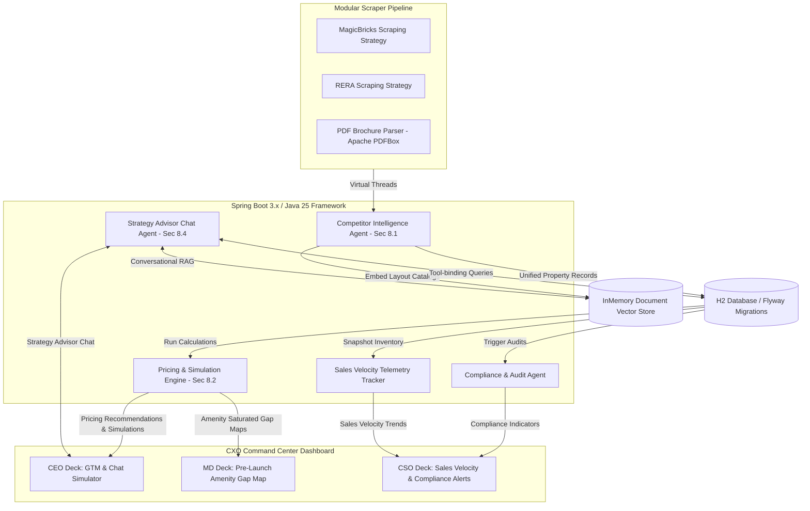
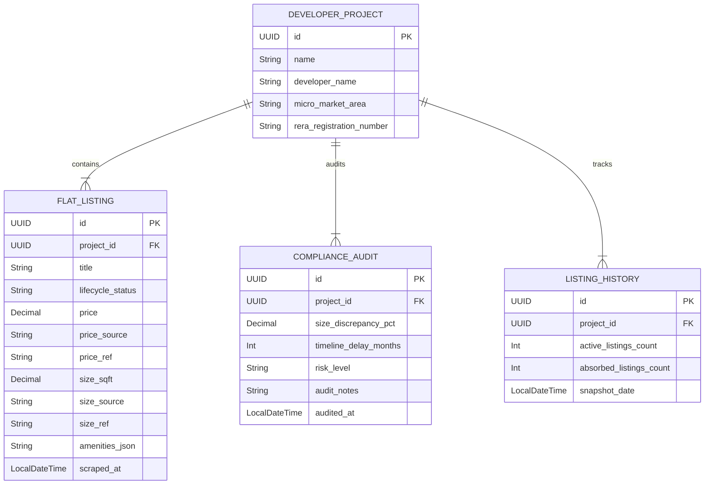

# Goal Description
Build the **Antigravity Real Estate Strategic Pricing & Competitive Intelligence Platform**, mapping directly to the provided **Business Requirement Document (BRD) dated 20-May-2026** and our **CXO Strategic Value Analysis**.

To deliver transformative market telemetry to real estate executive leadership, the system is architected as an **Executive Command Center**. It integrates **Java 25+** (using Virtual Threads for parallel multi-source ingestion) and **LangChain4j** to drive four advanced strategic intelligence modules:
1. **Competitor Intelligence Agent** (Sec 8.1): Pulls hybrid RERA registers, MagicBricks listings, and developer PDFs.
2. **Compliance & Audit Agent** (RERA-to-Market Discrepancy Engine): Cross-references legal layouts against active listings.
3. **Pricing & Simulation Engine** (Sec 8.2 & 8.4): Runs dynamic floor-rise, brand premium, and competitor discount models.
4. **Sales Velocity Telemetry Tracker** (Absorption Engine): Snapshots inventory volume changes over time to compute sales velocities.

---

## Redesigned Enterprise Architecture



---

## Detailed Component Specifications

### 1. Competitor Intelligence Agent (`CompetitorIntelligenceAgent.java`)
- **Ingestion**: Orchestrates Jsoup scraping strategies and PDF parsing on **Java 25 Virtual Threads**.
- **Normalization**: Standardizes raw properties, cleaning address strings into standard Mumbai neighborhoods (e.g. Bandra West, Thane West) and mapping amenities to standardized tags (e.g. `SWIMMING_POOL`, `CLUBHOUSE`, `ELEVATOR`).

### 2. Compliance & Audit Agent (`ComplianceAuditAgent.java`)
- **Goal**: Protect corporate regulatory standing and discover listing inaccuracies.
- **Process**: Compares RERA records (authoritative legal values) against public listings (MagicBricks) for the same development project:
  - Compares registered carpet area vs. advertised sizes.
  - Compares registered possession date vs. advertised timelines.
- **Output**: Generates a `ComplianceReport` indicating the discrepancy percentage and safety warning level (Green, Amber, Red).

### 3. Pricing & Simulation Engine (`PricingSimulationEngine.java`)
- **Goal**: Optimize GTM price structures and simulate competitor reactions.
- **Features**:
  - **Amenities Premium Calculation**: Compares average PSF of properties *with* a pool/gym against properties *without* them to isolate the premium factor.
  - **Floor-Rise Optimizer**: Evaluates competitor floor-specific pricing cards to recommend optimal upward pricing increments per floor level.
  - **Conversational Simulations**: Binds a Gemini-powered LangChain4j agent with tool-calling capabilities to the database, allowing executives to simulate rate changes dynamically.

### 4. Sales Velocity Telemetry Tracker (`SalesVelocityTracker.java`)
- **Goal**: Compute real-time competitor absorption rates.
- **Process**: Automatically snapshots active MagicBricks listing volumes on a configured schedule, storing counts in `listing_history`.
- **Velocity Formula**:
  $$\text{Sales Velocity} = \frac{\Delta \text{ Listings Added} - \Delta \text{ Listings Removed}}{\Delta t}$$
- **Output**: Calculates the absorption rate for specific micro-markets, flagging hot (fast inventory movement) and cold segments.

---

## Redesigned Database Schema



---

## Proposed Changes

### Component: Core Database Migrations (Flyway)

#### [NEW] [V1__init_real_estate_schema.sql](file:///c:/sandbox/competitive-analysis/src/main/resources/db/migration/V1__init_real_estate_schema.sql)
Creates the redesigned multi-table schema supporting telemetry history and audits:
```sql
CREATE TABLE developer_projects (
    id UUID PRIMARY KEY,
    name VARCHAR(255) NOT NULL,
    developer_name VARCHAR(255) NOT NULL,
    micro_market_area VARCHAR(255) NOT NULL,
    rera_registration_number VARCHAR(100),
    created_at TIMESTAMP WITH TIME ZONE DEFAULT CURRENT_TIMESTAMP
);

CREATE TABLE flat_listings (
    id UUID PRIMARY KEY,
    project_id UUID NOT NULL,
    title VARCHAR(255) NOT NULL,
    lifecycle_status VARCHAR(50) NOT NULL, -- 'PRE_LAUNCH', 'UNDER_CONSTRUCTION', 'READY_TO_MOVE'
    price DECIMAL(15, 2),
    price_source VARCHAR(100),
    price_ref VARCHAR(2048),
    size_sqft DECIMAL(10, 2),
    size_source VARCHAR(100),
    size_ref VARCHAR(2048),
    amenities_json TEXT,
    scraped_at TIMESTAMP WITH TIME ZONE DEFAULT CURRENT_TIMESTAMP,
    FOREIGN KEY (project_id) REFERENCES developer_projects(id)
);

CREATE TABLE compliance_audits (
    id UUID PRIMARY KEY,
    project_id UUID NOT NULL,
    size_discrepancy_pct DECIMAL(5, 2),
    timeline_delay_months INT,
    risk_level VARCHAR(20) NOT NULL, -- 'SAFE', 'AMBER_ALERT', 'CRITICAL_DISCREPANCY'
    audit_notes TEXT,
    audited_at TIMESTAMP WITH TIME ZONE DEFAULT CURRENT_TIMESTAMP,
    FOREIGN KEY (project_id) REFERENCES developer_projects(id)
);

CREATE TABLE listing_history (
    id UUID PRIMARY KEY,
    project_id UUID NOT NULL,
    active_listings_count INT NOT NULL,
    absorbed_listings_count INT NOT NULL,
    snapshot_date TIMESTAMP WITH TIME ZONE DEFAULT CURRENT_TIMESTAMP,
    FOREIGN KEY (project_id) REFERENCES developer_projects(id)
);
```

---

### Component: Core Backend Services (Java 25 & LangChain4j)

#### [NEW] [com/antigravity/companalysis/model/](file:///c:/sandbox/competitive-analysis/src/main/java/com/antigravity/companalysis/model/)
JPA mappings for `DeveloperProject`, `FlatListing`, `ComplianceAudit`, and `ListingHistory`.

#### [NEW] [com/antigravity/companalysis/service/agent/](file:///c:/sandbox/competitive-analysis/src/main/java/com/antigravity/companalysis/service/agent/)
- `CompetitorIntelligenceAgent.java`: Hybrid parallel virtual-thread scraper.
- `ComplianceAuditAgent.java`: Performs matching between RERA and listing elements to log timeline and sizing discrepancies.
- `PricingSimulationEngine.java`: Runs calculations for amenity values, floor-rise steps, and GTM scenario parameters.
- `SalesVelocityTracker.java`: Periodically aggregates counts to log listing history and calculate absorption rates.
- `StrategyAdvisorAgent.java`: Integrates Chat service, offering natural-language RAG over PDF catalogs and data queries.

---

### Component: Executive UI Command Center

#### [NEW] [index.html](file:///c:/sandbox/competitive-analysis/src/main/resources/static/index.html)
A stunning multi-tab glassmorphic layout:
1. **Tab 1: CEO Command (GTM Deck)**: Price-point slider panels, brand-equity premium charts, and a Strategy AI Assistant Chat.
2. **Tab 2: MD Command (Pre-Launch Deck)**: Matrix of micro-market amenity gaps and upcoming developer RERA timelines.
3. **Tab 3: CSO Command (Operations Deck)**: Sales velocity charts (absorption rate metrics), compliance audit logs with clickable discrepancies, and dynamic alerts.

#### [NEW] [styles.css](file:///c:/sandbox/competitive-analysis/src/main/resources/static/css/styles.css)
Cyber-slate backdrop (`#080c14`), glowing tab borders, floating frosted panels (`backdrop-filter: blur(20px)`), vibrant neon purple/teal gradients, and glowing amber/red warning badges.

---

## Verification Plan

### Automated Tests
1. **Compliance Engine Test**: Verify that a simulated RERA size of 1000 sqft and a MagicBricks size of 1100 sqft registers a 10% discrepancy alert.
2. **Velocity Tracker Test**: Simulate listing entries dropping over 3 sequential snapshots and verify that the Sales Velocity coefficient matches mathematically.

### Manual Verification
1. Open the UI.
2. Run automated crawls across sample listings.
3. Switch between CEO, MD, and CSO tabs to verify that all premium telemetry metrics load accurately.
